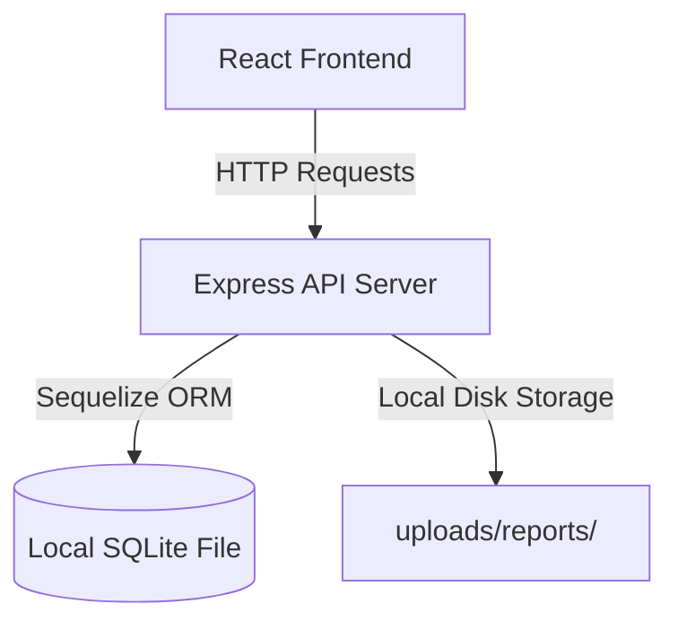
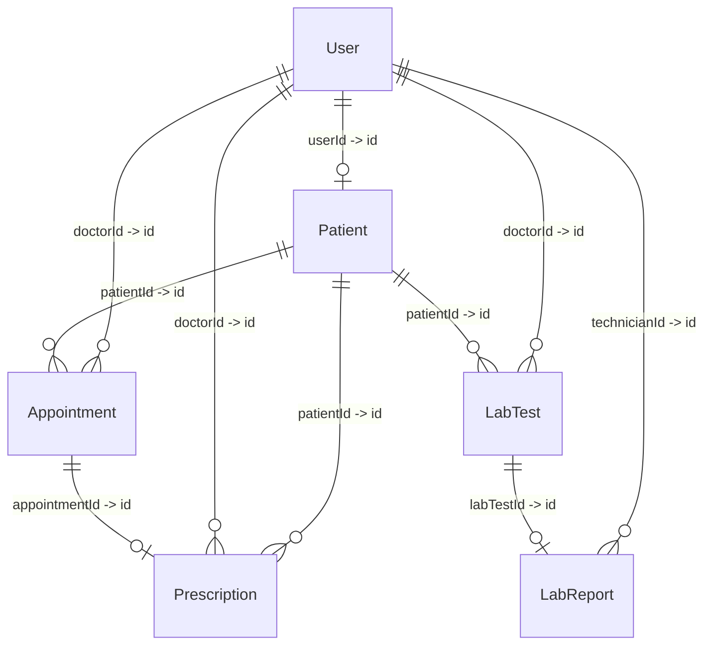
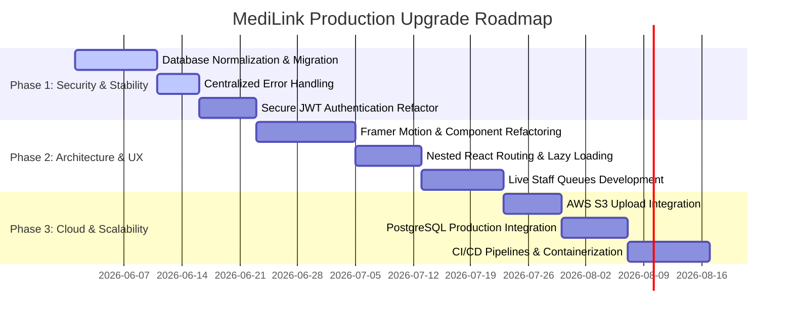

# 🏥 MediLink: Deep Architectural & UI/UX Analysis Report

This document presents a senior-level, comprehensive architectural audit, UI/UX evaluation, and production-grade security and scalability analysis of the **MediLink** Healthcare Management platform. 

---

## 1. Executive Summary

MediLink has been constructed as a prototype for a role-based healthcare management dashboard. While the system demonstrates a solid baseline clinical flow (Admin, Doctor, Patient, Lab Technician, and Pharmacist), a deep architectural audit reveals that **it is structured as a monolithic prototype rather than a production-ready, scalable SaaS platform**. 

### Core Strengths
- **Functional Roles**: Clear separation of responsibilities among users.
- **ORM Integration**: Structured database schema definitions via Sequelize.
- **Aesthetic Intent**: Attempted modern look using glassmorphism and Tailwind CSS.
- **Core Clinical Workflows**: Unified login, patient registration, digital health cards, and laboratory report uploads.

### Critical Deficiencies
- **Data Integrity & Server Stability**: Server-crashing code pathways in critical endpoints (e.g., appointments fetch), lack of transaction management, and first-normal-form (1NF) relational database violations.
- **Security Vulnerabilities**: High-risk session lengths (30 days), client-side authorization bypassable states, loose CORS configurations, missing rate-limiting, and clear-text credentials in seed modules.
- **Architectural Antipatterns**: Giant monolithic components (400+ lines), broken React routing patterns that map dozens of routes to the same dashboard layout selector, and local storage state duplication.
- **UI/UX & Accessibility Execution**: Severe layout-breaking syntax bugs in Tailwind classes, non-responsive rigid sizing of key visual components (MediLink card), and inefficient search-dependent workflows for laboratory and pharmacy queues.

This report dissects these vulnerabilities and presents a production-grade refactoring blueprint to uplift MediLink into an enterprise-grade healthcare SaaS system.

---

## 2. Overall Architecture Review

### Current Monolithic Design
The system is divided into a Node.js/Express backend and a React/Vite frontend. The architecture is tightly coupled, relying on synchronous local database reads/writes, local file system uploads, and rigid role state assumptions.



### Architectural Flaws & Anti-Patterns
1. **Local File System Binding**: File uploads are routed to local disk storage (`uploads/reports/`). This represents a single point of failure (SPOF) and prevents the application from scaling horizontally. If multiple server instances are deployed behind a load balancer, instances will lack access to reports uploaded on other instances.
2. **Synchronous/Blocking Execution**: Complex aggregations (e.g., `getPatientHistory` pulling appointments, prescriptions, and lab tests) are resolved in a single database query cycle without caching or pagination.
3. **Implicit Route Trust**: The frontend acts as the gatekeeper of user role states, leading to vulnerabilities where client modifications (such as modifying `localStorage`) can trigger visual role shifts.
4. **Lack of Separation of Concerns**: Database operations, ID/QR generation, and business rules are coupled directly inside the controller tier.

---

## 3. Frontend Analysis

### Monolithic Components & State Duplication
- **`DoctorDashboard.jsx` (404 lines)**: Acts as a kitchen-sink component. It controls registration, schedules appointments, builds multi-item prescriptions, requests lab tests, handles search states, and controls 5 separate modals simultaneously. This leads to massive re-renders, complex state trees, and unmaintainable code.
- **State Leakage**: User profiles are stored in both React Context (`AuthContext`) and local storage (`medilink_user`). If an Admin modifies a user's details, the user's active session state in the client remains stale until they manually log out and back in.

### React Router Misuse
A major architectural anomaly exists in `App.jsx`:
```javascript
<Route index element={<DashboardSelector />} />
<Route path="users" element={<DashboardSelector />} />
<Route path="registrations" element={<DashboardSelector />} />
...
```
Nearly 10 distinct subpaths render the identical `<DashboardSelector />` component, which determines the view solely by inspecting `user.role`. This renders URL paths useless for deep-linking, breaks browser history states, and prevents bookmarking of specific views (e.g., a doctor bookmarking `/dashboard/appointments`).

---

## 4. Backend Analysis

### Controller Bloat & Business Logic Leakage
Controllers are carrying database-level lifecycle responsibilities. For instance, in `patientController.js`, unique string generation and QR code creation are performed inside the controller:
```javascript
const patientId = generatePatientId();
const qrCode = await generateQRCode(patientId);
// ... User.create and Patient.create
```
This logic should reside in Sequelize model hooks (e.g., `beforeCreate` / `beforeValidate`) to ensure that whenever a Patient is registered via any interface (REST API, seed script, CLI tool), the ID and QR code are automatically generated and validated.

### Error Handling Anti-Pattern
Every controller function uses raw `try-catch` blocks returning generic `500` HTTP status codes with database exception strings appended:
```javascript
catch (error) {
  res.status(500).json({ message: 'Server error', error: error.message });
}
```
**Impact**: Appending `error.message` directly in HTTP responses is a severe security risk. It exposes SQL schema details, table structures, and internal code paths to malicious actors.

---

## 5. Database Analysis

The database uses SQLite through Sequelize ORM. While SQLite is acceptable for low-throughput prototypes, the database schema suffers from structural limitations.

### Database Schema Entity-Relationship (ER) Map



### Relational Schema Issues
1. **JSON Array in Prescription Model**: Storing medications as a JSON array (`medications: { type: DataTypes.JSON }`) violates **First Normal Form (1NF)**. Medications cannot be indexed, queried individually (e.g., finding all patients prescribed "Amoxicillin"), or historically audited easily.
2. **Double Patient Identifiers**: `Patient` has a standard database primary key UUID (`id`) and a business ID (`patientId` e.g., `MED-123456`). The relationships in the tables use `patientId` (a UUID foreign key) but the code confusingly switches between looking up the database UUID and the business string, creating mapping vulnerabilities.
3. **Date/Time Split Anti-Pattern**: In `Appointment.js`, `date` is `DataTypes.DATEONLY` and `time` is `DataTypes.TIME`.
    - **Impact**: It is impossible to handle timezone shifts, calculate duration, or index chronological order efficiently without parsing strings in memory.

---

## 6. UI/UX Analysis

### Critical Spacing and Layout Bugs
The visual polish of MediLink is broken by structural styling bugs:

#### 1. In `PatientDashboard.jsx` (Tailwind Syntax Crash):
```javascript
className={`px- 2 py - 1 rounded - lg text - [10px] font - bold uppercase ${...}`}
```
**Why it fails**: The spaces inside `px- 2`, `py - 1`, `rounded - lg`, `text - [10px]`, and `font - bold` completely invalidate these utility tokens in Tailwind. The status badges render completely unstyled, appearing as flat, raw text against the container background.

#### 2. Rigid Component Scale:
The `MediLinkCard` uses absolute millisecond-precise sizing:
```javascript
style={{ width: '85.6mm', height: '53.98mm' }}
```
**Why it fails**: While physical printing looks excellent, this container refuses to shrink or adapt to smaller device screens, causing immediate horizontal overflows and breaking container containers on mobile viewports.

### Design Inconsistencies & Workflow Flaws
- **Sidebar Visual Glitch**: The class `shadow-primary-200Translation` in `Sidebar.jsx` contains an appended text string, breaking the shadow styling of active elements.
- **Workflow Bottlenecks (Lab & Pharmacy)**: In both `LabDashboard.jsx` and `PharmacyDashboard.jsx`, staff are met with a completely empty state prompting them to enter a patient ID. In a clinical environment, this is highly inefficient. There should be a **Live Queue** showing active prescriptions or pending laboratory orders waiting to be fulfilled.

---

## 7. Security Analysis

An evaluation of the security configuration reveals several high-severity vulnerabilities:

| Vulnerability Area | Severity | Root Cause | Business Impact |
| :--- | :--- | :--- | :--- |
| **Session Length** | High | JWT expiration hardcoded to `30d`. | A compromised device keeps API access active for 30 days without re-auth. |
| **Loose CORS** | Medium | `app.use(cors())` with no origin whitelist. | Any malicious site can make cross-origin API calls on behalf of users. |
| **Client Role Switching** | High | Client can call `switchRole` to modify local state. | Users can manipulate frontend views to mimic higher roles. |
| **Cleartext Seed Data** | High | Cleartext passwords stored in `seed.js`. | Leakage of developer scripts exposes default system passwords. |
| **Multer File Validation** | Medium | Multer callback passes raw string error. | Causes Express server crashes during invalid file uploads. |

---

## 8. Performance Analysis

### Inefficient Database Queries & N+1 Problems
In `patientController.js`, `getPatientHistory` performs deep eager loading:
```javascript
const patient = await Patient.findByPk(id, {
    include: [
        { model: User, as: 'user' },
        { model: Appointment, as: 'appointments', include: [...] },
        { model: Prescription, as: 'prescriptions', include: [...] },
        { model: LabTest, as: 'labTests', include: [...] }
    ]
});
```
**Why this fails**: This triggers an incredibly heavy relational join. As a patient's historical records grow, this single query will fetch hundreds of records across five database tables, leading to severe latency bottlenecks.

### Unoptimized State Renders
Because `DoctorDashboard` and `AdminDashboard` handle all sub-modals, form submissions, and large list search filters in a single react file, *every keystroke* typed into any form input causes the entire dashboard, including large user/patient data tables, to completely re-render.

---

## 9. Scalability Analysis

```
[Local Disk Storage] <-- Single Point of Failure (Horizontal scaling blocked)
         ^
         | (Local Path Binding)
[App Instance 1]      [App Instance 2]
         \                 /
          \               /
      [Load Balancer / Ingress]
```

### Horizontally-Scaled Deployment Blockers
1. **Multer Local Storage**: PDF reports are written directly to `uploads/reports/`. If you deploy a second instance of the backend, reports uploaded on Instance 1 will return `404 Not Found` when requested by a client connected to Instance 2.
2. **SQLite Database Locking**: SQLite locks the entire database file during write operations (`BEGIN IMMEDIATE`). In a multi-user hospital environment, concurrent appointment creations, lab updates, and logins will result in `SQLITE_BUSY` database lock errors.

---

## 10. File-by-File Critical Issues

Here is the exact analysis of every module inside the codebase:

### Backend Architecture

#### 1. [server.js](file:///f:/VS%20CODE/MediLink/backend/server.js)
- **Vulnerability**: Direct database synchronization (`sequelize.sync()`) runs on every application startup. If schema changes occur in production, this can lead to accidental data wipes or schema locking.
- **Mitigation**: Switch to Sequelize migrations and run them in a separate deploy pipeline.

#### 2. [config/database.js](file:///f:/VS%20CODE/MediLink/backend/config/database.js)
- **Vulnerability**: Configuration parameters (dialect, storage path) are hardcoded.
- **Mitigation**: Move config variables to `.env` using a single dynamic connection string URI.

#### 3. [models/index.js](file:///f:/VS%20CODE/MediLink/backend/models/index.js)
- **Vulnerability**: No custom indexes are configured on foreign key mappings (`doctorId`, `patientId`, `userId`), causing full-table searches.
- **Mitigation**: Add database indexing definitions for all common relational keys.

#### 4. [models/User.js](file:///f:/VS%20CODE/MediLink/backend/models/User.js)
- **Vulnerability**: Lack of unique indexes on email allows multiple records with identical emails.
- **Mitigation**: Set `unique: true` and validate email inputs during write cycles.

#### 5. [models/Patient.js](file:///f:/VS%20CODE/MediLink/backend/models/Patient.js)
- **Vulnerability**: QR code base64 text is written directly into a database `TEXT` attribute.
- **Mitigation**: Dynamically generate QR codes on the frontend using standard packages instead of storing heavy base64 strings in the DB.

#### 6. [models/Appointment.js](file:///f:/VS%20CODE/MediLink/backend/models/Appointment.js)
- **Vulnerability**: Date and Time are split into separate attributes (`DATEONLY` and `TIME`).
- **Mitigation**: Consolidate into a single `DATETIME` or UTC `TIMESTAMP` attribute.

#### 7. [models/Prescription.js](file:///f:/VS%20CODE/MediLink/backend/models/Prescription.js)
- **Vulnerability**: Violates 1NF by packing multi-item arrays into a `JSON` text block.
- **Mitigation**: Normalise by extracting to a child relation named `PrescriptionItem`.

#### 8. [models/LabTest.js](file:///f:/VS%20CODE/MediLink/backend/models/LabTest.js)
- **Vulnerability**: Hardcoded ENUM values restrict the workflow strictly to `Requested` or `Completed`.
- **Mitigation**: Use string types with lookup maps or validation boundaries.

#### 9. [models/LabReport.js](file:///f:/VS%20CODE/MediLink/backend/models/LabReport.js)
- **Vulnerability**: Bound strictly to local relative paths.
- **Mitigation**: Reconfigure `filePath` to store remote cloud URIs (S3/Cloudinary).

#### 10. [controllers/authController.js](file:///f:/VS%20CODE/MediLink/backend/controllers/authController.js)
- **Vulnerability**: Long-lived JWT tokens without a dynamic rotation protocol.
- **Mitigation**: Restructure JWT session flow to use access tokens and HTTP-Only cookies.

#### 11. [controllers/userController.js](file:///f:/VS%20CODE/MediLink/backend/controllers/userController.js)
- **Vulnerability**: Encrypts password details directly inside the controller block.
- **Mitigation**: Relocate password hashing to Model Hooks.

#### 12. [controllers/patientController.js](file:///f:/VS%20CODE/MediLink/backend/controllers/patientController.js)
- **Vulnerability**: Giant history query fetches heavy collections in a single roundtrip.
- **Mitigation**: Add paginated limits (`limit` and `offset`) for history records.

#### 13. [controllers/appointmentController.js](file:///f:/VS%20CODE/MediLink/backend/controllers/appointmentController.js)
- **Vulnerability**: Serves as the origin of high-priority crash due to unchecked object retrieval.
- **Mitigation**: Add null checks before pulling object keys.

#### 14. [controllers/prescriptionController.js](file:///f:/VS%20CODE/MediLink/backend/controllers/prescriptionController.js)
- **Vulnerability**: Missing verification of medicine details prior to record writing.
- **Mitigation**: Add model validators to check JSON properties.

#### 15. [controllers/labController.js](file:///f:/VS%20CODE/MediLink/backend/controllers/labController.js)
- **Vulnerability**: Unchecked lab test update ignores missing entity scenarios.
- **Mitigation**: Implement transaction management when updating multiple tables.

#### 16. [middleware/auth.js](file:///f:/VS%20CODE/MediLink/backend/middleware/auth.js)
- **Vulnerability**: Lacks `return` statements on errors, risking double-evaluation.
- **Mitigation**: Always prepend `return` to termination responses.

#### 17. [middleware/upload.js](file:///f:/VS%20CODE/MediLink/backend/middleware/upload.js)
- **Vulnerability**: Throws raw text messages on validation failures.
- **Mitigation**: Wrap errors in standard `new Error(...)` structures.

#### 18. [routes/auth.js](file:///f:/VS%20CODE/MediLink/backend/routes/auth.js)
- **Vulnerability**: Route lacks password brute-force prevention.
- **Mitigation**: Add `express-rate-limit` to authentication routes.

#### 19. [routes/user.js](file:///f:/VS%20CODE/MediLink/backend/routes/user.js)
- **Vulnerability**: Rigidly bound to Admin controls.
- **Mitigation**: Restructure routes to allow role-based self-management.

#### 20. [routes/patient.js](file:///f:/VS%20CODE/MediLink/backend/routes/patient.js)
- **Vulnerability**: Wide-open profile route does not restrict records to the owner.
- **Mitigation**: Enforce ownership validation middleware.

#### 21. [routes/appointment.js](file:///f:/VS%20CODE/MediLink/backend/routes/appointment.js)
- **Vulnerability**: Exposes appointments to modification without authorization check.
- **Mitigation**: Secure PATCH updates with role checks.

#### 22. [routes/prescription.js](file:///f:/VS%20CODE/MediLink/backend/routes/prescription.js)
- **Vulnerability**: Anyone can pull all prescriptions.
- **Mitigation**: Secure route parameters with role limits.

#### 23. [routes/lab.js](file:///f:/VS%20CODE/MediLink/backend/routes/lab.js)
- **Vulnerability**: Unvalidated lab test search.
- **Mitigation**: Bind requests to authorized patient/doctor IDs.

#### 24. [utils/utils.js](file:///f:/VS%20CODE/MediLink/backend/utils/utils.js)
- **Vulnerability**: Math.random() is cryptographically insecure.
- **Mitigation**: Replace with node's native `crypto.randomBytes()`.

#### 25. [seed.js](file:///f:/VS%20CODE/MediLink/backend/seed.js)
- **Vulnerability**: Wipes database using `{ force: true }` without environment safety check.
- **Mitigation**: Add checks to restrict seeding behavior strictly to development environments.

---

### Frontend Architecture

#### 26. [main.jsx](file:///f:/VS%20CODE/MediLink/frontend/src/main.jsx)
- **Vulnerability**: Lacks boundary protection on UI errors.
- **Mitigation**: Wrap main application component in a React Error Boundary.

#### 27. [App.jsx](file:///f:/VS%20CODE/MediLink/frontend/src/App.jsx)
- **Vulnerability**: Broken routing layout bypasses page navigation.
- **Mitigation**: Rebuild routing tree using React Router nested layouts.

#### 28. [index.css](file:///f:/VS%20CODE/MediLink/frontend/src/index.css)
- **Vulnerability**: Overrides global space utility classes which causes unexpected element alignment.
- **Mitigation**: Migrate styling properties strictly to Tailwind utilities.

#### 29. [context/AuthContext.jsx](file:///f:/VS%20CODE/MediLink/frontend/src/context/AuthContext.jsx)
- **Vulnerability**: Vulnerable client role switching functionality.
- **Mitigation**: Remove dynamic client-side role manipulation.

#### 30. [services/api.js](file:///f:/VS%20CODE/MediLink/frontend/src/services/api.js)
- **Vulnerability**: Hardcoded local API endpoints.
- **Mitigation**: Inject dynamic backend base paths via Environment variables.

#### 31. [layouts/DashboardLayout.jsx](file:///f:/VS%20CODE/MediLink/frontend/src/layouts/DashboardLayout.jsx)
- **Vulnerability**: Lacks scroll containers, causing view truncation.
- **Mitigation**: Bind container constraints using explicit layout wrappers.

#### 32. [components/Sidebar.jsx](file:///f:/VS%20CODE/MediLink/frontend/src/components/Sidebar.jsx)
- **Vulnerability**: Typos in shadow classes prevent correct rendering.
- **Mitigation**: Correct CSS class text and refactor routing hooks.

#### 33. [components/Navbar.jsx](file:///f:/VS%20CODE/MediLink/frontend/src/components/Navbar.jsx)
- **Vulnerability**: Commented out notification system.
- **Mitigation**: Re-enable notification components with real-time SSE or WebSocket triggers.

#### 34. [components/StatsCard.jsx](file:///f:/VS%20CODE/MediLink/frontend/src/components/StatsCard.jsx)
- **Vulnerability**: Rigid layout style causes overflow bugs.
- **Mitigation**: Re-style card containers to adapt cleanly to various screen sizes.

#### 35. [components/MediLinkCard.jsx](file:///f:/VS%20CODE/MediLink/frontend/src/components/MediLinkCard.jsx)
- **Vulnerability**: Strict millimeter scaling causes overflow.
- **Mitigation**: Build dynamic scale states using CSS transformations.

#### 36. [components/Modal.jsx](file:///f:/VS%20CODE/MediLink/frontend/src/components/Modal.jsx)
- **Vulnerability**: Broken modal exit animations.
- **Mitigation**: Wrap component logic in Framer Motion conditional trees.

#### 37. [pages/Login.jsx](file:///f:/VS%20CODE/MediLink/frontend/src/pages/Login.jsx)
- **Vulnerability**: Credentials are exposed directly in UI code comments.
- **Mitigation**: Strip hardcoded accounts from frontend UI.

#### 38. [pages/dashboards/AdminDashboard.jsx](file:///f:/VS%20CODE/MediLink/frontend/src/pages/dashboards/AdminDashboard.jsx)
- **Vulnerability**: Heavy in-memory table lists freeze interface.
- **Mitigation**: Break forms into atomic visual blocks and add server search.

#### 39. [pages/dashboards/DoctorAppointments.jsx](file:///f:/VS%20CODE/MediLink/frontend/src/pages/dashboards/DoctorAppointments.jsx)
- **Vulnerability**: Time calculations are done with local strings.
- **Mitigation**: Standardize all date-time operations using Date Fns or Day.js.

#### 40. [pages/dashboards/DoctorDashboard.jsx](file:///f:/VS%20CODE/MediLink/frontend/src/pages/dashboards/DoctorDashboard.jsx)
- **Vulnerability**: Giant monolithic codebase manages all operations.
- **Mitigation**: Refactor features into independent page layouts.

#### 41. [pages/dashboards/LabDashboard.jsx](file:///f:/VS%20CODE/MediLink/frontend/src/pages/dashboards/LabDashboard.jsx)
- **Vulnerability**: Restricts access strictly through custom searches.
- **Mitigation**: Integrate active queue system displaying all unfulfilled laboratory orders.

#### 42. [pages/dashboards/PatientDashboard.jsx](file:///f:/VS%20CODE/MediLink/frontend/src/pages/dashboards/PatientDashboard.jsx)
- **Vulnerability**: Broken Tailwind layout classes.
- **Mitigation**: Clean spacing bugs and wrap list tables in scroll containers.

#### 43. [pages/dashboards/PharmacyDashboard.jsx](file:///f:/VS%20CODE/MediLink/frontend/src/pages/dashboards/PharmacyDashboard.jsx)
- **Vulnerability**: Missing dynamic pagination locks up active queues.
- **Mitigation**: Refactor prescription searches to support dynamic server search.

#### 44. [pages/dashboards/Profile.jsx](file:///f:/VS%20CODE/MediLink/frontend/src/pages/dashboards/Profile.jsx)
- **Vulnerability**: Users are unable to edit their own profile details.
- **Mitigation**: Build update actions allowing password shifts.

---

## 11. High Priority Bugs

### 🚨 Server Crash in `getAppointments`
- **Root Cause**: `appointmentController.js` line 25:
  ```javascript
  const patient = await Patient.findOne({ where: { userId: req.user.id } });
  where.patientId = patient.id;
  ```
  If `patient` is null (e.g., database synchronization lag, or testing users without patient profile rows), it throws a `TypeError: Cannot read properties of null (reading 'id')` and crashes the execution node.
- **Correction**:
  ```javascript
  const patient = await Patient.findOne({ where: { userId: req.user.id } });
  if (!patient) {
      return res.status(404).json({ message: 'Patient profile not found.' });
  }
  where.patientId = patient.id;
  ```

### 🚨 Completely Broken Badge Styles
- **Root Cause**: `PatientDashboard.jsx` lines 108-113 contains broken Tailwind syntax strings with spaces:
  ```javascript
  className={`px- 2 py - 1 rounded - lg text - [10px] font - bold uppercase ${...}`}
  ```
- **Correction**: Replace with valid, space-free Tailwind CSS classes:
  ```javascript
  className={`px-2 py-1 rounded-lg text-[10px] font-bold uppercase ${...}`}
  ```

### 🚨 Blocked Framer Motion Exit Animations
- **Root Cause**: `Modal.jsx` returns `null` before executing the `AnimatePresence` wrapper logic:
  ```javascript
  if (!isOpen) return null;
  return ( <AnimatePresence> ... </AnimatePresence> )
  ```
- **Correction**: Move the conditional render inside the `AnimatePresence` tag:
  ```javascript
  return (
    <AnimatePresence>
      {isOpen && (
        <div className="fixed inset-0 z-[9999] flex items-center justify-center p-4 bg-slate-900/40 backdrop-blur-md">
          ...
        </div>
      )}
    </AnimatePresence>
  );
  ```

---

## 12. Medium Priority Improvements

1. **Model Password Hook**: Relocate password hashing during updates out of `userController.js` and into a global `beforeUpdate` Sequelize hook inside `User.js`.
2. **Multer Crash Fix**: Modify `upload.js` so it passes standard error instances on check failure instead of plain strings:
   ```javascript
   cb(new Error('Only Images and PDFs are allowed!'));
   ```
3. **Admin Exclusivity Bypass**: Modify `appointmentController.js` to ensure system administrators are not blocked by ownership checks (`appointment.doctorId !== req.user.id`) when attempting to delete appointment records.

---

## 13. Low Priority Enhancements

1. **Crypto Identity Codes**: Uplift random ID generations in `utils.js` from `Math.random()` to cryptographically secure alternatives:
   ```javascript
   import crypto from 'crypto';
   export const generatePatientId = () => `MED-${crypto.randomBytes(3).toString('hex').toUpperCase()}`;
   ```
2. **Dynamic QR Generation**: Remove binary-heavy base64 string storage of QR codes in `Patient` profile database records and replace with real-time, on-demand QR code rendering inside the frontend `MediLinkCard` using React library tools.

---

## 14. Production-Level Upgrade Suggestions

### 1. File Storage Migration (S3/Cloudinary)
Migrate PDF and image uploads to an object storage provider such as AWS S3 or Google Cloud Storage. 

```javascript
import { S3Client } from '@aws-sdk/client-s3';
import multerS3 from 'multer-s3';

const s3 = new S3Client({ region: process.env.AWS_REGION });

const upload = multer({
  storage: multerS3({
    s3: s3,
    bucket: process.env.AWS_BUCKET_NAME,
    acl: 'public-read',
    metadata: (req, file, cb) => {
      cb(null, { fieldName: file.fieldname });
    },
    key: (req, file, cb) => {
      cb(null, `reports/${Date.now()}-${file.originalname}`);
    }
  })
});
```

### 2. Secure JWT Architecture
1. Short-lived Access Token (15 mins) passed in JSON payloads.
2. Secure, HTTP-Only Cookie Refresh Token (7 days) to authenticate refresh cycles.

```javascript
res.cookie('refreshToken', refreshToken, {
  httpOnly: true,
  secure: process.env.NODE_ENV === 'production',
  sameSite: 'strict',
  maxAge: 7 * 24 * 60 * 60 * 1000 // 7 days
});
```

---

## 15. UI Modernization Suggestions

### Modern Premium Dark-Glass Aesthetics
Transform the interface from standard Tailwind styles to an Apple-inspired premium dark-glass dashboard:

```css
/* Custom index.css enhancements */
.glass-panel {
  background: rgba(255, 255, 255, 0.45);
  backdrop-filter: blur(20px);
  -webkit-backdrop-filter: blur(20px);
  border: 1px solid rgba(255, 255, 255, 0.3);
  box-shadow: 0 8px 32px 0 rgba(31, 38, 135, 0.08);
}

.premium-gradient {
  background: linear-gradient(135deg, #f5f7fa 0%, #c3cfe2 100%);
}
```

### Interactive Micro-Animations
Add interactive scale and hover effects across cards, buttons, and elements:
```javascript
import { motion } from 'framer-motion';

export const InteractiveButton = ({ children, onClick }) => (
  <motion.button
    whileHover={{ scale: 1.02, translateY: -1 }}
    whileTap={{ scale: 0.98 }}
    onClick={onClick}
    className="btn-primary"
  >
    {children}
  </motion.button>
);
```

---

## 16. Refactoring Recommendations

### Decoupling `DoctorDashboard.jsx`
Extract monolithic modules into dedicated components:

```
├── pages/dashboards/doctor/
│   ├── index.jsx                  <-- Main layout shell
│   ├── PatientTable.jsx           <-- Render patient lists
│   ├── PatientHistoryModal.jsx    <-- Renders historical profiles
│   ├── RegistrationModal.jsx      <-- Client registration form
│   ├── AppointmentModal.jsx       <-- Schedule creation form
│   └── PrescriptionModal.jsx      <-- Prescription details form
```

### Decoupling Business Logic
Use React Custom Hooks to handle complex state management:

```javascript
// hooks/useDoctorState.js
import { useState, useEffect } from 'react';
import api from '../services/api';

export const useDoctorState = () => {
  const [patients, setPatients] = useState([]);
  const [loading, setLoading] = useState(true);

  const fetchPatients = async () => {
    try {
      const { data } = await api.get('/patients');
      setPatients(data);
    } catch (err) {
      console.error(err);
    } finally {
      setLoading(false);
    }
  };

  return { patients, loading, refetch: fetchPatients };
};
```

---

## 17. Suggested Folder Restructuring

Reorganize the project structure to enforce clean separation of concerns:

```
├── backend/
│   ├── src/
│   │   ├── config/             # DB & environment setups
│   │   ├── constants/          # Role and status structures
│   │   ├── controllers/        # Business route triggers
│   │   ├── middleware/         # Security & validator hooks
│   │   ├── models/             # Database mappings
│   │   ├── routes/             # Endpoints map
│   │   ├── services/           # Encryption, file & cloud drivers
│   │   ├── utils/              # Helper codes
│   │   └── app.js              # Express instantiation
│   └── server.js               # Start listener
│
├── frontend/
│   ├── public/
│   ├── src/
│   │   ├── assets/             # Branding files
│   │   ├── components/         # Global atom UIs (Button, Input)
│   │   ├── context/            # Auth managers
│   │   ├── hooks/              # Reusable React hooks
│   │   ├── layouts/            # Wrappers & Nav layouts
│   │   ├── pages/              # Screen containers
│   │   │   ├── auth/           # Login screen files
│   │   │   └── dashboards/     # Modular role views
│   │   ├── services/           # Axios configs
│   │   ├── utils/              # Helper codes
│   │   ├── App.jsx             # Routes map
│   │   └── main.jsx            # Launch root
```

---

## 18. Suggested API Improvements

### RESTful URL Standardizations
Standardize endpoints to follow REST guidelines:
- `POST /api/lab/request` ➔ `POST /api/lab-tests`
- `POST /api/lab/upload` ➔ `POST /api/lab-tests/:id/reports`
- `GET /api/lab/tests` ➔ `GET /api/lab-tests`

### Centralized Exception Handler
Avoid duplicate `try-catch` structures by routing controller exceptions to a centralized error middleware:

```javascript
// middleware/errorMiddleware.js
export const errorHandler = (err, req, res, next) => {
  const statusCode = err.statusCode || 500;
  
  res.status(statusCode).json({
    success: false,
    message: err.message || 'Internal Server Error',
    stack: process.env.NODE_ENV === 'production' ? null : err.stack
  });
};
```

---

## 19. Suggested Database Improvements

### 1. Migrating to PostgreSQL / MySQL
Replace SQLite with an enterprise-ready relational database like PostgreSQL to prevent thread locking:

```javascript
// config/database.js
const sequelize = new Sequelize(process.env.DATABASE_URL, {
  dialect: 'postgres',
  protocol: 'postgres',
  dialectOptions: {
    ssl: process.env.NODE_ENV === 'production' ? { require: true, rejectUnauthorized: false } : false
  },
  pool: {
    max: 10,
    min: 2,
    acquire: 30000,
    idle: 10000
  },
  logging: false
});
```

### 2. Normalizing Prescriptions
Migrate medications from unstructured JSON arrays to normalized tables:

```javascript
// models/PrescriptionItem.js
const PrescriptionItem = sequelize.define('PrescriptionItem', {
  id: { type: DataTypes.UUID, defaultValue: DataTypes.UUIDV4, primaryKey: true },
  name: { type: DataTypes.STRING, allowNull: false },
  dosage: { type: DataTypes.STRING, allowNull: false },
  frequency: { type: DataTypes.STRING, allowNull: false }
});

// index.js
Prescription.hasMany(PrescriptionItem, { as: 'medicationDetails', onDelete: 'CASCADE' });
PrescriptionItem.belongsTo(Prescription);
```

---

## 20. Final Professional Upgrade Roadmap

To successfully transition MediLink from a prototype to a production-grade SaaS product, execute this three-phase professional roadmap:



### Phase 1: Security & Core Stability (Duration: 22 Days)
- **Objective**: Fix server-crashing bugs, secure session handling, and normalize the database schema.
1. Fix the server crash in `getAppointments` and styling anomalies.
2. Standardize all API error responses using centralized middleware.
3. Migrate `Prescription` model relationships away from raw JSON arrays.
4. Replace cleartext database seeds with hashed credential scripts.
5. Secure access sessions via short-lived tokens and secure HTTP-Only refresh cookies.

### Phase 2: Component Architecture & UI Refinement (Duration: 30 Days)
- **Objective**: Refactor monolithic view files, fix layout rendering problems, and optimize the user workflow.
1. Refactor monolithic layout pages (like `DoctorDashboard`) into focused, single-responsibility modules.
2. Re-engineer `App.jsx` to leverage React Router nesting and dynamic parameter loading (`/dashboard/patient/:id`).
3. Correct broken Framer Motion exit animations.
4. Replace millimeter absolute card sizing with dynamic CSS scaling viewport wrappers.
5. Create live workload queues for laboratory technicians and pharmacy staff.

### Phase 3: Cloud Integration & Scalability (Duration: 25 Days)
- **Objective**: Prepare the application for horizontal scaling, secure cloud deployments, and multi-user environments.
1. Migrate the local file store to AWS S3 or Google Cloud Storage.
2. Replace local SQLite databases with fully-managed PostgreSQL clusters.
3. Package application services using Docker containers.
4. Configure production environment parameters (.env overrides) for API and CORS whitelists.
5. Establish automated CI/CD pipelines to run test suites on code merges.
